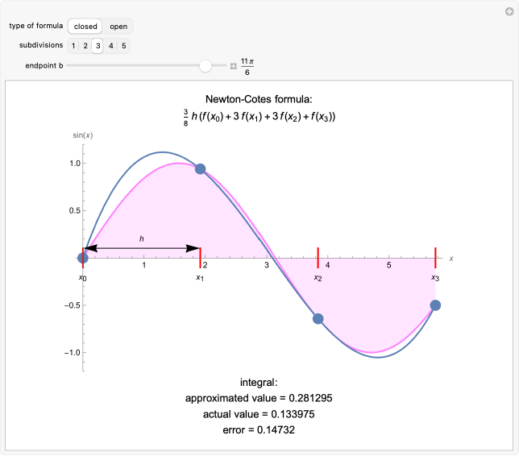

# Newton-Cotes Quadrature

## Table of Contents
- [Overview](#Overview)
- [History](#History)
- [Process](#Process)
- [Differences from Other Types of Quadrature](#Differences-from-Other-Types-of-Quadrature)
- [Derivations](#Derivations)
- [Error](#Error)
- [Extension to Composite Quadrature](#Extension-to-Composite-Quadrature)
- [References](#References)

Newton-Cotes Quadrature. How it works, what makes it different from other types of quadrature. When it might be used over other types of quadrature. How to derive different quadrature rules of different "degrees". Extension to composite quadrature rules.
## Overview
Quadrature refers to any method for determining the definite integral of a function over a defined interval, typically involving a numerical method. 
Newton-Cotes quadrature is a form of quadrature that involves using an interpolating polynomial over a set of equally spaced points within the interval, which is then integrated to get an approximation of the integral of the original function. 
There are two types of Newton-Cotes quadrature: the closed-form, which uses the endpoints of the interval in it's computation of the interpolating polynomial, and the open-form, which only considers the interior points.
## History
Isaac Newton, in his *Principia* (1687), proposed a theory of numerical integration by polynomial interpolation, believing that a parabola defined between two points would be able to approximate a curved area to solve for the area under the curve. 
He used this theory to propose his first assumption about the nature of the approximation, which is today known as the "Simpson's 3/8 rule".
He then, in his manuscript *Of Quadrature by Ordinates* (1695), proposed a method for determining the weights, in which, due to the ratios of his error terms being incorrect, his values were slightly off. 
Roger Cotes furthered the work of Newton in his *Harmonia Mensurarum* (1722), determining the weights for values up to $n = 11$, hence the name "Newton-Cotes quadrature". 

</img>

</img>
## Process
The steps to apply the method for closed-form quadrature on the intergral ($\int_{a}^{b} f(x) dx\$) are as follows:
1. Determine a desired polynomial degree $n$.
2. Define a set of x-values equally spaced between $a$ and $b$ ($x_i= a+ih$ for $i$ from 0 to $n$ inclusive and where $h = \frac{b−a}{n}$).
3. Compute $f(x_i)$ for each value of $x_i$.
4. Use predetermined weights ($H_{i,n}$) at each value to compute the integral. The weights are [computed](#Derivations) in such a way as to mimic the behavior of the interpolating polynomial over that interval. The final value is
   $$\int_{a}^{b} f(x) dx = h\sum_{i=0}^{n} H_{i,n}f(x_i) + E_n(f)$$
   , where $E_n(f)$ is the error term associated with the approximation.

Weights ($H_{i,n}$) for Closed-Form Quadrature for $n$ = 1 to 5

| $n$       | $H_{i,n}$                                |
| -------------------------------- |:--------------------------------------:|
| 1      | $\frac{1}{2}$, $\frac{1}{2}$   |
| 2      | $\frac{1}{6}$, $\frac{2}{3}$, $\frac{1}{6}$      | 
| 3      | $\frac{1}{8}$, $\frac{3}{8}$, $\frac{3}{8}$, $\frac{1}{8}$     |
| 4      | $\frac{7}{90}$, $\frac{32}{90}$, $\frac{12}{90}$, $\frac{32}{90}$, $\frac{7}{90}$    |
| 5      | $\frac{19}{288}$, $\frac{25}{96}$, $\frac{25}{144}$, $\frac{25}{144}$, $\frac{25}{96}$, $\frac{19}{288}$    |

The most well-known forms of the Newton-Cotes closed-form quadrature are the trapezoidal rule (with an interpolating polynomial degree of $n=1$), Simpson's 1/3 rule (with $n = 2$), and Simpson's 3/8 rule (with $n = 3$). 
These are widely regarded due to their simplicity and precision, though they have a tendency to misrepresent functions over large intervals with more complex curvature due to their simplicity. 

The open-form quadrature method works similarly, but does not consider values at the endpoints $a$ and $b$ in the computation, using only the interior points. This changes the defined weights for computation. The final value is still the same: $$\int_{a}^{b} f(x) dx = h\sum_{i=0}^{n} H_{i,n}f(x_i) + E_n(f)$$. 

Weights ($H_{i,n}$) for Open-Form Quadrature for $n$ = 0 to 5

| $n$       | $H_{i,n}$                                |
| -------------------------------- |:--------------------------------------:|
| 0      | 1  |
| 1      | $\frac{1}{2}$, $\frac{1}{2}$      | 
| 2      | $\frac{2}{3}$, $-\frac{1}{3}$, $\frac{2}{3}$     |
| 3      | $\frac{1}{24}$, $\frac{11}{24}$, $\frac{11}{24}$, $\frac{1}{24}$    |
| 4      | $\frac{11}{20}$, $-\frac{7}{10}$, $\frac{13}{10}$, $-\frac{7}{10}$, $\frac{11}{20}$ |
| 5      | $\frac{611}{1440}$, $-\frac{151}{480}$, $\frac{281}{720}$, $\frac{281}{720}$, $-\frac{151}{480}$, $\frac{611}{1440}$ |
## Differences from Other Types of Quadrature
Newton-Cotes quadrature, as opposed to other forms of quadrature such as Gaussian quadrature and spline quadrature, is simple, requiring low derivative computation that can be done by hand or by simple programs. It also does not vary the weights necessary for interpolation and samples at equally spaced points. Therefore, in cases where the values at equally spaced intervals are given, Newton-Cotes quadrature is easier to compute. 

However, for larger values of $n$ and higher desired accuracy, the approximation can produce erratic results and the problem can become ill-defined due to Runge's phenomenon. For any value above $n=11$, there will be at least one negative weight in closed form quadrature, and in general, $\sum_{i=0}^{n} |H_{i,n}| \rightarrow \infty$ as $n \rightarrow \infty$. Instead, it is better to divide the interval into [subintervals](#Extension-to-Composite-Quadrature) or to switch to another quadrature method.

</img>

One alternative is to use a least-squares approximation instead of a polynomial interpolation. Knowing that approximations with a lower value of $n$ have stronger noise suppression, least-squares approximations can be used to derive higher order integration filters. The main cost to this, however, is a larger constant in the error term than traditional Newton-Cotes quadrature. 
## Derivations
The polynomial necessary to integrate for the approximation is the Lagrange interpolating polynomial, which has inputs of the x and y coordinates of the points comprising it. For points ($x_0$, $y_0$), ($x_1$, $y_1$), ... , ($x_n$, $y_n$), it is first necessary to get the basis polynomials, which are the set of polynomials $l_i$ for which $l_i(x_k) = 0$ for $i \neq k$ and $l_i(x_i) = 1$. The basis polynomials can be written as 

$$l_i(x) = \frac{(x - x_0)(x - x_1)...(x-x_{i-1})(x-x_{i+1})...(x-x_n)}{(x_i - x_0)(x_i - x_1)...(x_i-x_{i-1})(x_i-x_{i+1})...(x_i-x_n)}$$

The Lagrange interpolating polynomial is then written as the linear combination of the basis polynomials:

$$L(x) = \sum_{i=0}^{n} y_il_i$$

For example, for the case of closed-form interpolation with n=2, there would be four points: ($x_0$, $y_0$), ($x_1$, $y_1$), ($x_2$, $y_2$), and ($x_3$, $y_3$). Then the basis polynomials would be written as

$$l_0(x) = \frac{(x - x_1)(x-x_2)(x-x_3)}{(x_0 - x_1)(x_0 - x_2)(x_0 - x_3)}$$

$$l_1(x) = \frac{(x - x_0)(x-x_2)(x-x_3)}{(x_1 - x_0)(x_1-x_2)(x_1-x_3)}$$

$$l_2(x) = \frac{(x - x_0)(x - x_1)(x-x_3)}{(x_2 - x_0)(x_2 - x_1)(x_2-x_3)}$$

$$l_3(x) = \frac{(x - x_0)(x - x_1)(x-x_2)}{(x_3 - x_0)(x_3 - x_1)(x_3-x_2)}$$

Noting that these points are equally spaced, so 
## Error
## Extension to Composite Quadrature
## References
1. El-Mikkawy, M. (2002). A unified approach to Newton–Cotes quadrature formulae. Applied Mathematics and Computation, 138(2–3), 403–413. https://doi.org/10.1016/s0096-3003(02)00144-3
2. Agbota, L. (2024). Newton-Cotes Quadrature Formulas with Error Term. https://doi.org/10.13140/RG.2.2.27346.98241
3. Catapang, L., Mandaje, J., & Siong, V. (2024). Convergence Analysis of Newton-Cotes methods: Optimizing Sub-Intervals selection for precise integral approximation. Applied Mathematics and Sciences: An International Journal, 11(1/2).
4. Osada, N. (2013). Isaac Newton’s “Of Quadrature by Ordinates.” Archive for History of Exact Sciences, 67(4), 457–476. http://www.jstor.org/stable/23479271
5. Sermutlu, E. (2005). Comparison of Newton–Cotes and gaussian methods of quadrature. Applied Mathematics and Computation, 171(2), 1048–1057. https://doi.org/10.1016/j.amc.2005.01.102
6. Magalhaes, P.A.A. & Magalhaes, C.A. Higher-Order Newton-Cotes Formulas. J. Math. Stat. 2010,6, 193–204.
7. Pavel Holoborodko (2011-03-24). ["Stable Newton-Cotes Formulas"](http://www.holoborodko.com/pavel/numerical-methods/numerical-integration/stable-newton-cotes-formulas/)
8. Das, Biswajit & Chakrabarty, Dhritikesh. (2016). Lagrange’s Interpolation Formula: Representation of Numerical Data by a Polynomial curve. International Journal of Mathematics Trends and Technology. 34. 64-72. 10.14445/22315373/IJMTT-V34P514. 
