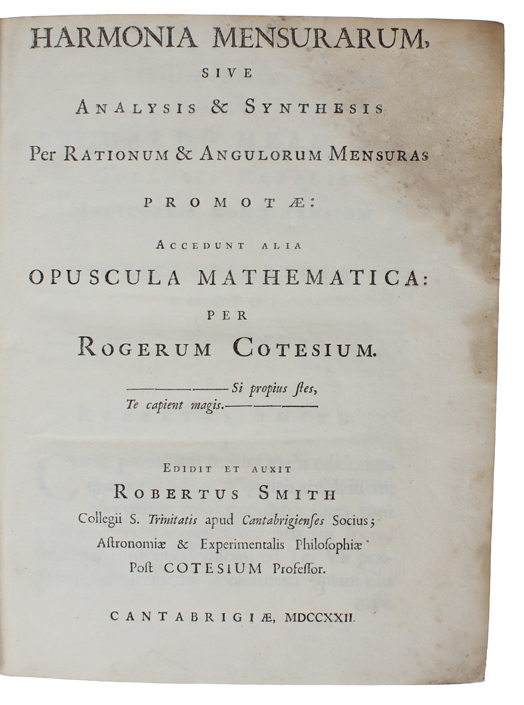
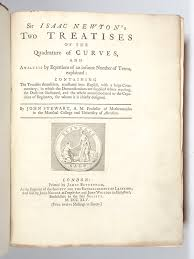

# Newton-Cotes Quadrature

## Table of Contents
- [Overview](#Overview)
- [History](#History)
- [Differences from Other Types of Quadrature](#Differences-from-Other-Types-of-Quadrature)
- [Uses](#Uses)
- [Derivations](#Derivations)
- [Error](#Error)
- [Extension to Composite Quadrature](#Extension-to-Composite-Quadrature)
- [References](#References)

Newton-Cotes Quadrature. How it works, what makes it different from other types of quadrature. When it might be used over other types of quadrature. How to derive different quadrature rules of different "degrees". Extension to composite quadrature rules.
## Overview
Newton-Cotes quadrature is a numerical method for determining the definite integral of a function ($\int_{a}^{b} f(x) dx\$). The steps to apply the method for closed-form quadrature are as follows:
1. Determine a desired polynomial degree $n$.
2. Define a set of x-values equally spaced between $a$ and $b$ ($x_i= a+ih$ for $i$ from 0 to $n$ inclusive and where $h = \frac{b−a}{n}$).
3. Compute $f(x_i)$ for each value of $x_i$.
4. Use predetermined weights ($H_{i,n}$) at each value to compute the integral. The final value is
   $$\int_{a}^{b} f(x) dx = \sum_{i=0}^{n} H_{i,n}f(x_i) + E_n(f)$$
   , where $E_n(f)$ is the error term associated with the approximation.

The open-form quadrature method works similarly, but does not consider values at the endpoints $a$ and $b$ in the computation, using only the interior points. This changes the defined weights for computation.
## History
Isaac Newton, in his *Principia* (1687), proposed a theory of numerical integration by polynomial interpolation, believing that a parabola defined between two points would be able to approximate a curved area to solve for the area under the curve. He used this theory to propose his first assumption about the nature of the approximation, which is today known as the "Simpson's 3/8 rule". He then, in his manuscript *Of Quadrature by Ordinates* (1695), proposed a method for determining the weights, in which, due to the ratios of his error terms being incorrect, his values were slightly off. Roger Cotes furthered the work of Newton in his *Harmonia Mensurarum* (1722), determining the weights for values up to $n = 11$, hence the name "Newton-Cotes quadrature". 

</img>

</img>
## Differences from Other Types of Quadrature
Newton-Cotes quadrature, as opposed to other forms of quadrature such as Gaussian quadrature, is simple, requiring low derivative computation that can be done by hand or by simple programs. However, for larger values of $n$ and higher desired accuracy, the approximation can produce erratic results and the problem can become ill-defined. For any value above $n=11$, there will be at least one negative weight, and in general, $\sum_{i=0}^{n} |H_{i,n}| \rightarrow \infty$ as $n \rightarrow \infty$. Instead, it is better to divide the interval into [subintervals](#Extension-to-Composite-Quadrature). 
## Uses
## Derivations
## Error
## Extension to Composite Quadrature
## References
1. El-Mikkawy, M. (2002). A unified approach to Newton–Cotes quadrature formulae. Applied Mathematics and Computation, 138(2–3), 403–413. https://doi.org/10.1016/s0096-3003(02)00144-3
2. Agbota, L. (2024). Newton-Cotes Quadrature Formulas with Error Term. https://doi.org/10.13140/RG.2.2.27346.98241
3. Catapang, L., Mandaje, J., & Siong, V. (2024). Convergence Analysis of Newton-Cotes methods: Optimizing Sub-Intervals selection for precise integral approximation. Applied Mathematics and Sciences: An International Journal, 11(1/2).
4. Osada, N. (2013). Isaac Newton’s “Of Quadrature by Ordinates.” Archive for History of Exact Sciences, 67(4), 457–476. http://www.jstor.org/stable/23479271
5. Sermutlu, E. (2005). Comparison of Newton–Cotes and gaussian methods of quadrature. Applied Mathematics and Computation, 171(2), 1048–1057. https://doi.org/10.1016/j.amc.2005.01.102 
